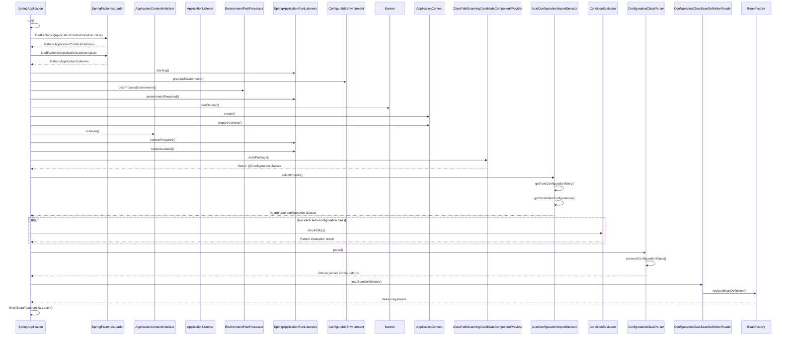

# user_details

Retrieving data from excel file and inserting into postgres db

This project demonstrates on how to fetch data from an excel file and update it in the database
using postgres database

Used Swagger to upload the data and executed the application

ExcelReaderService contains **readExcelFile**

-This method is responsible for reading data from an Excel file (represented by a MultipartFile), parsing it, and
returning a list of UserInfo objects.

**XSSFWorkbook**: Used when you need to read from or write to an Excel workbook in the .xlsx format.

1. **MultipartFile** is designed to encapsulate the information and content of an uploaded file,
   such as its name, content type, size, and the actual content as an input stream.
2. You use MultipartFile as a parameter type in Spring MVC controller methods that handle file uploads.
3. When a client submits a form with a file input field,
   Spring automatically binds the uploaded file to a MultipartFile parameter in your controller method.

apache poi: We have to include this external library from maven repository in order to work on excel
and retrieve the excel sheet column information and then map it to the pojo (entity).

Removed Rate Field

Changed Exp field to String datatype
Added GetByID in the controller for bench profiles and daily submissions

Steps

- `SpringApplication.run()` is called.
- Load `ApplicationContextInitializers` and `ApplicationListeners` from `META-INF/spring.factories`.
  - These initializers will be used later to set up the ApplicationContext.
- Load ApplicationListeners:
  - Similarly, SpringFactoriesLoader loads all ApplicationListener implementations.
  - Notify listeners that the application is starting (`SpringApplicationRunListeners.starting()`).
- Run Listeners (Starting)
  - SpringApplicationRunListeners.starting() is called, notifying listeners that the application is starting.

- Prepare the environment:
  - ConfigurableEnvironment is prepared, which includes
    - Setting up property sources (application.properties, application.yml, environment variables, etc.)
    - Setting up active profiles
  - Apply EnvironmentPostProcessors. EnvironmentPostProcessor beans are invoked to further customize the environment.
- Notify listeners that the environment is prepared `SpringApplicationRunListeners.environmentPrepared()`
- Print the Spring Boot banner (if enabled).
- Create the appropriate ApplicationContext.
  - The appropriate ApplicationContext is created based on the application type (e.g., AnnotationConfigServletWebServerApplicationContext for web applications).
- Prepare the context:
  - Set the environment.
  - Configure the bean name generator and resource loader.
- Initialize the context using ApplicationContextInitializers.
- Notify listeners that the context is prepared and then loaded (SpringApplicationRunListeners.contextPrepared() and contextLoaded()).
- Component Scanning: The `ClassPathScanningCandidateComponentProvider` scans the classpath for classes annotated with `@Configuration`.
- Autoconfiguration process:
  a. AutoConfigurationImportSelector selects auto-configuration classes.
  b. Candidate configurations are loaded from META-INF/spring.factories.
  c. ConditionEvaluator checks conditions for each auto-configuration class.
  d. ConfigurationClassParser processes the selected configurations.
  e. ConfigurationClassBeanDefinitionReader loads bean definitions into the BeanFactory.
- Finish bean factory initialization:
   - Instantiate all non-lazy singleton beans.
- Notify listeners that the context has been refreshed
  - (SpringApplicationRunListeners.started()).
- Run ApplicationRunners and CommandLineRunners
- Notify listeners that the application is ready (SpringApplicationRunListeners.running()).